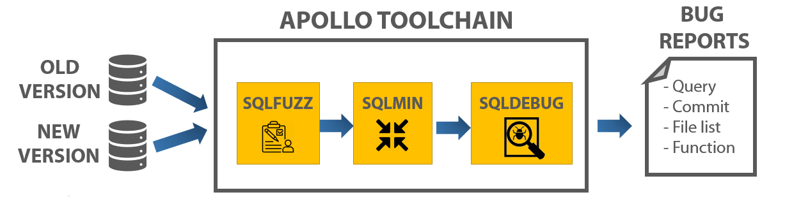

# APOLLO


We automate the generation of regression-triggering queries, simplifies the bug reporting process for users, and enables developers to quickly pinpoint the root cause of performance regressions. By automating the detection and diagnosis of performance regressions, APOLLO reduces the labor cost of developing efficient DBMSs.




### SQLFuzz

SQLFUZZ will perform feedback-driven mutational fuzzing to generate SQL statements and provide wider coverage of the SQL input domain. The key idea is to guide the fuzzing engine based on domain-specific feedback (i.e., probability for each clause in a SQL query), including runtime performance.

* [Doc: regression fuzzing](src/sqlfuzz/README.md)

### SQLMin

SQLMIN will automatically distill the regression-activating SQL statements discovered by SQLFUZZ to their essence for filing regression reports. The user will send the regression report to the developers containing the query reduced by SQLMIN.

* Note: we integrated the SQLMin into SQLFuzz (i.e., SQLFuzz minimizes the query once it identifies performance regression)

### SQLDebug

The developer will use SQLDEBUG to diagnose the root cause of the regression from the simplified test case produced by SQLMIN.

* [Doc: automated Diagnosis](src/sqldebug/README.md)

### Supporting DBMS

| DBMS | SQLFuzz | Feedback-driven | SQLMin | SQLDebug |
| --- | --- | --- | --- | --- |
| PostgreSQL | O | O | O | O |
| SQLite3 | O | WIP (cleaning up code) | O | O |
| CockroachDB | O | O | O | X |


# Installation

* Install dependencies and compile libraries
```bash
./install-deps.sh
./compile-libs.sh
```

* Install DBMS
[DBMS Install](doc/Install-dbms.md)


# Quick Start

* Run with default option (fuzzing PostgreSQL)

```
$ cd src/sqlfuzz
$ ./fuzz.py -c configuration/postgres.yaml
```

# To-be updated soon

- [ ] Usability
  - [WIP] Provide Dockerfile for fuzzing and minimizing
  - [WIP] Provide Dockerfile for debugging
  - [ ] Implement wrapper script for bisecting
- [ ] Support feedback-driven fuzzing
  - [X] PostreSQL
  - [X] CockroachDB
  - [ ] SQLite
- [ ] CockroachDB
  - [WIP] Clecn up code to support CockroachDB


# Cite

* VLDB Vol13

```
@inproceedings{jung:apollo,
  title        = {{APOLLO: Automatic Detection and Diagnosis of Performance Regressions in Database Systems (to appear)}},
  author       = {Jinho Jung and Hong Hu and Joy Arulraj and Taesoo Kim and Woonhak Kang},
  booktitle    = {Proceedings of the 46th International Conference on Very Large Data Bases (VLDB)},
  month        = aug,
  year         = 2020,
  address      = {Tokyo, Japan},
}
```

* Contact: Jinho Jung (jinho.jung@gatech.edu)