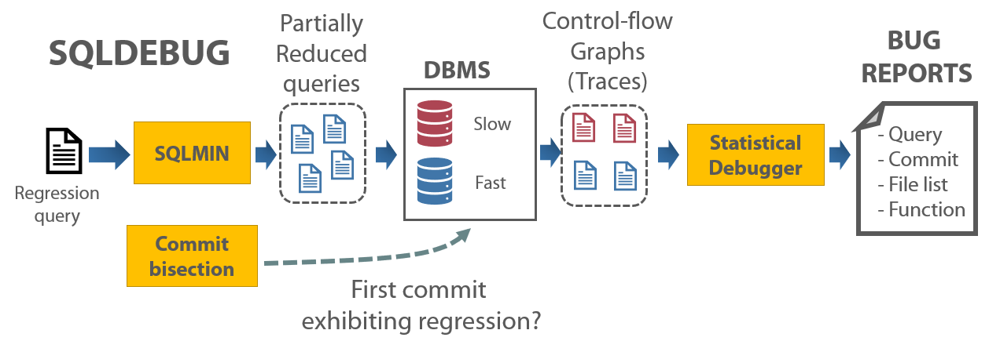

Overview
--------




Prerequisite
------------

### Compile and Install DynamoRIO

* Clone DynamoRIO repository

```bash
$ git clone https://github.com/DynamoRIO/dynamorio.git
```

* Patch file for compiling tracing library

```bash
# copy library
$ cp dynamorio_patch/*.c dynamorio/api/samples/

# patch dynamorio/api/samples/CMakeLists.txt: insert one line
add_sample_client(cbrtrace    "cbrtrace.c;utils.c"    "drmgr;drx")
+ add_sample_client(cbrtrace2    "cbrtrace2.c;utils.c"    "drmgr;drx")
```

* Compile the dynamorio

```bash
# compile
$ cd dynamorio
$ mkdir build
$ cd build
$ cmake ..
$ make -j 4

# check compiled library (libcbrtrace.so and libcbrtrace2.so)
$ ls -al api/bin/*.so
```

* Example script to capture the trace

```bash
$ dynamorio/build/bin64/drrun -c dynamorio/build/api/bin/libcbrtrace.so -- YOUR_SQLITE YOUR_DB.db <  YOUR_QUERY.sql
```

Debugging SQLITE3
-----------------

## Setup fossil Sqlite for bisect

### 1) Clone fossil repo

```bash
mkdir sqlite_fossil
cd sqlite_fossil
fossil clone https://www.sqlite.org/src sqlite.fossil
fossil open sqlite.fossil
```

* If we do regression fuzzing on `sqlite 3.23.0` and `sqlite 3.27.0`, we should find commit ID (you can use the following commands to find out)
  * sqlite 3.23.0: `736b53f57f`
  * sqlite 3.27.0: `c9af2f71bf`

### 2) Some useful commands

```bash
; dump fossil log
$ fossil timeline -n 30000 > sqlite_log
$ cat sqlite_log|grep -v "\=\=\=" > sqlite_log2
$ cat sqlite_log2|grep "\:" |grep "\[" |grep "\]" > sqlite_log3

$ python
import sys
import fileinput
for line in fileinput.input('sqlite_log3', inplace=True):
    if line.startswith(' '):
        continue
    if "ticket [" in line.lower() or 'edit [' in line.lower():
        continue
    else:
        sys.stdout.write(line)

; working with tag
$ fossil tag list
$ fossil update tag:version-3.23.0

; diff commits
$ fossil diff --from f08c1731b0 --to 736b53f57f

; go to specific commit
$ fossil checkout 27e20d6998
$ fossil checkout 736b53f57f

```

## Bisect problematic commit

``` bash
./bisect.py -db sqlite -i sq_ex -r sqlite_fossil -l bisect_log
```

* `-db` or `--database`: Required, target database (e.g., sqlite or postgres)

* `-i` or `--indir`: Required, input directory where regression-inducing SQL queries are located

* `-r` or `--repodir`: Required, repository directory (either `git` or `fossil`)

* `-l` or `--logfile`: Optional, log filename

* **Important:** You SHOULD know which commit is related to the performence regression bug. After identify the commit number, you should compile two DBMS with debug symbol.

  * #1: DBMS which initially introduces performance regression (e.g., SQLite_bad)
  * #2: DBMS which lastly showed good performance (e.g., SQLite_good)

## Extract execution trace thru DBI

* Capture the execution trace using

## Statistical debugging

`To be updated`

However, we added demo to show how it works.

```bash
$ cd {REPO}/src/sqldebug/demo
python statdbg_sqlite.py sqlite2
```


Debugging PostgreSQL
---------------------

## Setup test repo

`To be updated`

## Bisect problematic commit

`To be updated`

## Dynamic Binary Instrumentation

`To be updated`

## Statistical debugging

`To be updated`

However, we added demo to show how it works.

``` bash
$ cd {REPO}/src/sqldebug/demo
python statdbg.py trace 898
```


Experimental
------------

## Delta LDA algorithm

`To be updated`

## Utility commands

`To be updated`