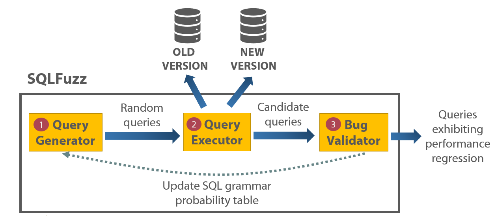

# General information

### Overview



* **Query generator**: random query generator

* **Query executor**: execute query on old and new version of DBMS

* **Bug validator**: remove false positive cases

### Configuration file

* You can specify detailed configuration

* Default configuration yaml files are under `configuration` directory

| Config attribute | Description |
| --- | --- |
| DBMS  | target DBMS name (e.g., postgres)  |
| DB | create database name |
| DB_VER | array about DBMS versions (for displaying) |
| DSN | URI string for connecting DBMS |
| FILEDB | whether DBMS is running on file system (e.g., sqlite) |
| INIT | should Apollo initialize the DB? |
| MIN | minimum query execution time that we should consider |
| NEW_VER_PORT | port number of new version of DBMS |
| OLD_VER_PORT | port number of old version of DBMS |
| PASSWORD | DBMS password |
| PREFIX | prefix string which is added to query |
| PROBRESET | how frequently reset the probability table (unit: minutes) |
| RUN_NEW | external command to run query |
| RUN_OLD | external command to run query |
| SQLSMITH_PORT | specify sqlsmith port (useful when fuzzing cockroachDB) |
| SQLSMITH_TIMEOUT | maximum query generation time |
| THRESHOLD | we will consider query as regression if it is larget than this |
| TIMEOUT | timeout for one query execution |
| USERNAME | DBMS username |
| USE_MINIMIZER | true if user wants auto-minimization on-the-fly |
| USE_PROB | true if user wants feedback-driven fuzzing |
| USE_TPCC | true if user wants to use pre-defined DB |

# Sqlite Fuzzing

### 1) Setup the DBMS (Install two versions of SQLite)

[DBMS Install](../../doc/Install-dbms.md)

### 2) Do fuzzing

``` bash
./fuzz.py -c configuration/sqlite.yaml
```

* NOTE: we do not support `probability` and `initialize` options for Sqlite and CockroachDB
  * Cleaning up the code now. They should be available soon.

# PostgreSQL Fuzzing (Install two versions of PostgreSQL)

### 1) Setup the DBMS

[DBMS Install](../../doc/Install-dbms.md)

### 2) Do fuzzing

``` bash
./fuzz.py -c configuration/postgres.yaml
```

# CockroachDB Fuzzing

### Documentation will be available soon

----

# Minimizer (Standalone mode)

``` bash
# e.g., Minimization queries in the directory
$ ./sql_minimizer.py -c configuration/postgres.yaml -d pg_ex

# e.g., Minimization single query
$ ./sql_minimizer.py -c configuration/sqlite.yaml -f sq_ex/16.sql
```

* Minimizer is executed in the middle of SQLFuzz

* However, user can also run it as standalone mode
  * `-c`: configuration file

  * `-d` or `--indir`: input directory which contains a number of SQL queries to be minimized

  * `-f` or `--infile`: single input file which needs query minimization
